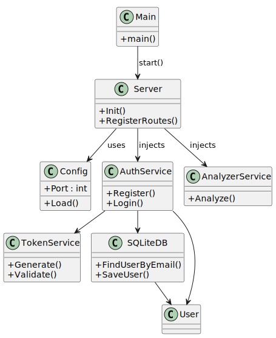

# 🍎 Food Analyzer API

A lightweight Go API to simulate food image analysis and authentication, intended for experimentation, learning, or bootstrapping more complex apps.

---

## ✨ Features

* 🔐 JWT-based auth (`/auth/register`, `/auth/login`)
* 📸 Upload food images and receive mocked nutrition data (`/food/analyze`)
* 🛠️ CLI control via Cobra (e.g., `--port`)
* 🐳 Docker-ready for easy containerized development
* 🧪 Integration tested using Python scripts

---

## 💪 Tech Stack

| Layer         | Tech                                    |
| ------------- | --------------------------------------- |
| Language      | Go 1.21+                                |
| Web Framework | [Fiber](https://gofiber.io)             |
| CLI           | [Cobra](https://github.com/spf13/cobra) |
| Auth          | JWT (`github.com/golang-jwt/jwt/v5`)    |
| ORM           | GORM with SQLite (dev) or PostgreSQL    |
| Container     | Docker + Docker Compose                 |
| Testing       | Python + Requests                       |

---

## 🧠 Architecture & Design Decisions



### 1. **Project Structure**

* Domain logic grouped under `/v1/` using versioning from the start.
* Clear separation of concerns:

  * `auth`: authentication logic
  * `analyzer`: mocked food analysis
  * `config`, `database`, `token`: utilities and plumbing
  * `server`: creates Fiber app, mounts routes, attaches middleware

### 2. **JWT Auth**

* JWT is used for simplicity and statelessness.
* Claims are extended via `CustomClaims`.
* Tokens are validated using a middleware.

### 3. **Image Upload**

* Images are parsed using multipart form.
* They are mocked (no real AI model) for nutrition analysis.

### 4. **CLI**

* The app can be run with flags (e.g., `--port 8080`).
* Cobra is used to allow further commands in the future.

### 5. **Docker Support**

* App runs in a self-contained Docker container.
* `docker-compose.yaml` spins up the API and database if needed.

### 6. **Middleware**

* JWT authentication middleware is just a single helper function inside server, and not a full architectural layer. This should be extended and middleware should exist as separate layer.

### 7. **Testing**

* Integration tests live under `/tests/`
* Written in Python for simplicity and external HTTP verification

### 8. **Why Cobra, Fiber, and GORM?**

* **Cobra** was chosen for CLI handling because it's the de-facto standard in Go for command-line applications. It offers strong flag parsing and a clean command hierarchy system which makes future CLI commands easy to add.
* **Fiber** was picked for its speed, simplicity, and Express-like API. It's a great fit for building lightweight HTTP APIs with low overhead and fast startup time.
* **GORM** provides a robust ORM layer for interacting with SQLite and PostgreSQL. It hides boilerplate SQL and supports auto-migrations and model definitions, which keeps the data layer lean and maintainable.

### 9. **Extensibility & Plug-in Interfaces**

Both the server and the database layers are designed to be pluggable:

#### Database

```go
// database/database.go

// Database defines a generic interface for CRUD operations on any data model T.
// Intended to be implemented by concrete backends like SQLite, Postgres, etc.
type Database[T any] interface {
  Create(item T) error
  Update(item T) error
  GetByID(id uint) (*T, error)
  GetByField(field string, value any) (*T, error)
  Delete(id uint) error
}

func NewDatabase[T any](dsn string, model T) (Database[T], error) {
  // here we can decide if we want to support other database (PostgreSQL, etc.)
  return newSqlite(dsn, model)
}
```

#### Server

```go
// server/server.go

// Server defines the interface for running the HTTP API server.
type Server interface {
  Start()
}

func NewServer(cfg config.Config) Server {
  // here we can decide if we want gin/fiber/custom etc.
  return newFiberServer(cfg)
}
```

This separation allows swapping implementations in the future (e.g., switching from Fiber to Gin or from SQLite to Postgres) without rewriting business logic.

---

## 🌱 Environment Variables

You can configure the API behavior using a `.env` file. The available options are:

```env
PORT=3000               # Port the server listens on
DATABASE_DSN=prod.db     # Path to SQLite or DSN for PostgreSQL
JWT_SECRET=changeme      # Secret key used to sign JWT tokens
JWT_EXPIRY=72            # Token expiry in hours
```

These are loaded automatically at startup.

---

## 🚀 Getting Started

### Prerequisites

* Go 1.21+
* Docker (optional, but recommended)
* Python (for integration tests)

### Local Run

```bash
go run ./cmd/food-analyzer-api --port 3000
```

### Docker Run

```bash
docker-compose up --build
```

---

## 🔁 API Usage

### Register

```bash
curl -X POST http://localhost:3000/auth/register \
  -H "Content-Type: application/json" \
  -d '{"email":"test@example.com","password":"123456","firstName":"John","lastName":"Doe"}'
```

### Login

```bash
curl -X POST http://localhost:3000/auth/login \
  -H "Content-Type: application/json" \
  -d '{"email":"test@example.com","password":"123456"}'
```

The response will include a JWT token, which you must use in the `Authorization` header for protected endpoints like `/food/analyze`.

### Upload Food Image

```bash
curl -X POST http://localhost:3000/food/analyze \
  -H "Authorization: Bearer <your_token>" \
  -F "image=@images/food.jpg"
```

---

## 📁 Folder Structure

```
.
├── cmd/
│   └── food-analyzer-api/      # CLI Entry
│       └── main.go
├── v1/
│   ├── analyzer/               # Mock food analysis
│   ├── auth/                   # Auth system
│   ├── config/                 # Config loading
│   ├── database/               # GORM init & utils
│   ├── token/                  # Token generation/validation
│   ├── server/                 # Fiber app setup, routing, and middleware
├── tests/                      # Python integration tests
├── docs/
│   └── architecture.svg        # Architecture diagram
├── Dockerfile
├── docker-compose.yaml
├── go.mod
├── go.sum
└── README.md
```

---

## 🧪 Running Tests

```bash
cd tests
pip install -r requirements.txt
python integration-tests.py
```

### Test Coverage

Currently, only integration tests are included to verify the API endpoints externally. These tests:

* Start from user registration and login
* Validate JWT issuance and token structure
* Confirm access control by hitting protected endpoints with and without tokens
* Upload food images and check for mocked nutrition data responses

---

## 🧊 Notes

* No actual ML or nutrition detection logic is present—pure mock.
* This is intended as a starter template or mock service backend.

---
